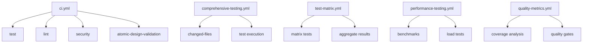

# UCKN Framework CI/CD Testing Workflows

This directory contains comprehensive GitHub Actions workflows for automated testing of the Universal Claude Code Knowledge Network (UCKN) framework.

## Workflow Overview

### Core CI/CD Pipeline (`ci.yml`)
- **Triggers**: Push/PR to main/development branches, releases
- **Jobs**:
  - Cross-platform testing (Ubuntu, macOS, Windows)
  - Multi-Python version support (3.10, 3.11, 3.12)
  - Code quality checks (lint, format, type checking)
  - Security scanning (Bandit, Safety)
  - Atomic design validation
  - Package building and deployment

### Comprehensive Testing (`comprehensive-testing.yml`)
- **Triggers**: Push/PR to main/development (excluding docs), manual dispatch
- **Features**:
  - Change detection with path filtering
  - Separate test execution by pytest markers (`unit`, `integration`, `e2e`)
  - Enhanced coverage reporting with baseline comparison
  - Quality gate enforcement
  - GitHub API status notifications
  - Artifact collection and preservation

### Test Matrix (`test-matrix.yml`)
- **Triggers**: Push/PR to main/development, manual dispatch
- **Features**:
  - Matrix testing across Python versions and test types
  - Marker-based test selection
  - Result aggregation across matrix jobs
  - Comprehensive artifact collection
  - Status reporting via GitHub API

### Performance & Load Testing (`performance-testing.yml`)
- **Triggers**: Weekly schedule (Sunday 3am UTC), manual dispatch, source changes
- **Features**:
  - Performance benchmark execution with pytest-benchmark
  - Automated load testing with Locust (headless mode)
  - Baseline performance comparison
  - Regression detection and alerting
  - Artifact collection for analysis
  - Automated issue creation for performance regressions

### Quality Metrics & Coverage (`quality-metrics.yml`)
- **Triggers**: Push/PR to main/development
- **Features**:
  - Comprehensive coverage reporting (HTML, XML, JSON, Markdown)
  - Differential coverage analysis for PRs
  - Quality gate enforcement (90% threshold)
  - PR comment integration with coverage summaries
  - Artifact upload for all report formats

### Pull Request Checks (`pr-checks.yml`)
- **Triggers**: PR events (opened, synchronized, reopened, ready for review)
- **Features**:
  - Quick lint checks on changed files only
  - Targeted testing for modified modules
  - Atomic design validation for changed files
  - Import structure verification
  - Coverage threshold enforcement (70% minimum)
  - Documentation update reminders

## Testing Strategy

### Test Types and Markers

The framework uses pytest markers for organized test execution:

```python
# Unit Tests
@pytest.mark.unit
def test_component_functionality():
    """Isolated component testing"""

# Integration Tests
@pytest.mark.integration
def test_component_interactions():
    """Component interaction testing"""

# End-to-End Tests
@pytest.mark.e2e
def test_complete_workflows():
    """Full workflow testing"""

# Performance Benchmarks
@pytest.mark.benchmark
def test_performance_benchmarks():
    """Performance measurement"""
```

### Test Execution Commands

```bash
# Run specific test types
pixi run test -m unit           # Unit tests only
pixi run test -m integration    # Integration tests only
pixi run test -m e2e           # E2E tests only
pixi run test -m benchmark     # Benchmark tests only

# Combined test execution
pixi run test-coverage         # All tests with coverage
pixi run test-coverage-json    # Coverage with JSON output

# Performance testing
pixi run benchmark             # Performance benchmarks
pixi run load-test-headless    # Automated load testing

# Quality metrics
pixi run quality-gate          # Quality gate enforcement
pixi run coverage-trend        # Coverage trend analysis
```

## Caching Strategy

All workflows implement aggressive caching for:
- Pixi environments (`actions/cache@v4`)
- Dependencies and build artifacts
- Test data and fixtures
- Performance baseline data

Cache keys include:
- Operating system
- Python version
- Test type
- `pyproject.toml` hash for dependency changes

## Artifact Management

### Comprehensive Testing Artifacts
- Coverage reports (HTML, XML, JSON)
- Test results by type (unit, integration, e2e)
- Quality gate reports
- Regression analysis data

### Performance Testing Artifacts
- Benchmark results (JSON format)
- Load test logs and metrics
- Resource usage monitoring data
- Performance regression alerts

### Matrix Testing Artifacts
- Individual test results by Python version and test type
- Aggregated results across all matrix combinations
- Comparative analysis reports

## Notification System

### GitHub API Integration
- Commit status updates for all workflow results
- Automated issue creation for performance regressions
- PR comments with coverage summaries
- Status badges and progress indicators

### Email Notifications (Optional)
Workflows support email notifications for failures:
- Test failures with environment details
- Quality gate violations
- Performance regression alerts

Configuration requires secrets:
- `SMTP_USERNAME`, `SMTP_PASSWORD`
- `NOTIFY_EMAILS`

## Quality Gates

### Coverage Requirements
- **Comprehensive Testing**: 90% branch coverage
- **PR Checks**: 70% minimum coverage
- **Differential Coverage**: 90% for new/changed code

### Performance Thresholds
- Benchmark regression detection
- Load test resource limits
- Memory usage monitoring
- Response time validation

### Code Quality Standards
- Ruff linting with zero F,E9 violations
- Black code formatting compliance
- MyPy type checking validation
- Atomic design structure enforcement

## Environment Configuration

### Required Environment Variables
```yaml
ENVIRONMENT: ci
PYTHONUNBUFFERED: 1
PIXI_ENV: ci
```

### Optional Secrets
```yaml
GITHUB_TOKEN: # Automatic
SMTP_USERNAME: # Email notifications
SMTP_PASSWORD: # Email notifications
NOTIFY_EMAILS: # Email recipients
```

## Workflow Dependencies



## Troubleshooting

### Common Issues

1. **Pixi Environment Failures**
   - Check `pyproject.toml` dependency specifications
   - Verify platform compatibility
   - Review cache invalidation

2. **Test Marker Issues**
   - Ensure pytest markers are properly configured
   - Validate test discovery patterns
   - Check marker-based test selection

3. **Performance Test Failures**
   - Verify load test infrastructure
   - Check resource availability
   - Review baseline performance data

4. **Coverage Threshold Failures**
   - Analyze coverage reports
   - Identify untested code paths
   - Review test completeness

### Debugging Commands

```bash
# Local testing
pixi run test -v --tb=long       # Verbose test output
pixi run test --collect-only     # Test discovery
pixi run test -m unit -v        # Debug unit tests

# Coverage analysis
pixi run test-coverage --html    # Generate HTML coverage
pixi run coverage report         # Terminal coverage report

# Performance debugging
pixi run benchmark --verbose     # Detailed benchmark output
pixi run load-test              # Interactive load testing
```

## Workflow Customization

### Adding New Test Types
1. Add pytest marker to `pyproject.toml`
2. Update matrix strategy in `test-matrix.yml`
3. Add marker-based execution in workflows
4. Update documentation

### Performance Monitoring
1. Configure baseline performance data
2. Set regression thresholds
3. Add custom performance metrics
4. Integrate monitoring tools

### Quality Metrics
1. Customize coverage thresholds
2. Add new quality checks
3. Configure reporting formats
4. Integrate external tools

This comprehensive testing infrastructure ensures high-quality, reliable, and performant code delivery for the UCKN framework.
